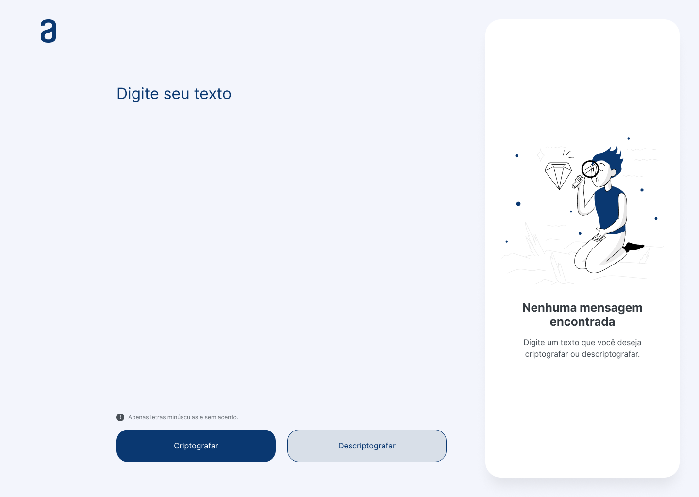

# Criptógrafo

---

## Challenge ONE - Iniciante em Programação

Este projeto foi desenvolvido utilizando HTML, CSS e Javascript (ECMAScript). É a resolução do desafio proposto pela Alura na formação "Iniciante em Programação T6 - ONE". Basicamente, consiste em criptografar e descriptografar textos.

    

---

## Oracle Next Education

O ONE é um programa de educação e empregabilidade com objetivo social de capacitar pessoas em tecnologia e conectá-las com o mercado de trabalho por meio de empresas parceiras.

O curso é 100% online e totalmente gratuito, feito para quem não teve acesso à educação de qualidade e deseja transformar a sua realidade social.

Esta formação faz parte do programa ONE, parceria de Alura + Oracle.

Saiba mais em https://www.oracle.com/br/education/oracle-next-education/

---

### Lógica de Criptografia

As "chaves" de criptografia utilizadas são:
- A letra "e" é convertida para "enter";
- A letra "i" é convertida para "imes";
- A letra "a" é convertida para "ai";
- A letra "o" é convertida para "ober";
- A letra "u" é convertida para "ufat".

### Requisitos:

- Deve funcionar apenas com letras minúsculas;
- Não devem ser utilizados letras com acentos nem caracteres especiais;
- Deve ser possível converter uma palavra para a versão criptografada e também retornar uma palavra criptografada para a versão original.
    Por exemplo:
    > "gato" => "gaitober"
    > gaitober" => "gato"
- A página deve ter campos para inserção do texto a ser criptografado ou descriptografado, e a pessoa usuária deve poder escolher entre as duas opções;
- O resultado deve ser exibido na tela.

### Extras:

- Um botão que copie o texto criptografado/descriptografado para a área de transferência - ou seja, que tenha a mesma funcionalidade do ctrl+C ou da opção "copiar" do menu dos aplicativos.

---

### Como visualizar o projeto

O projeto está disponível neste momento no GitHub Pages. Basta acessar o site: <https://josuemleite.github.io/challenge-one-cryptographer/>.

Também, é possível visualizar o protótipo realizado no Figma: <https://www.figma.com/file/sA7InKRMzEoiwaXKEwJ5TC/Alura-Challenge---Desafio-1---L%C3%B3gica?type=design&node-id=0%3A1&mode=design&t=hknqJpxtJF2tL59j-1>.